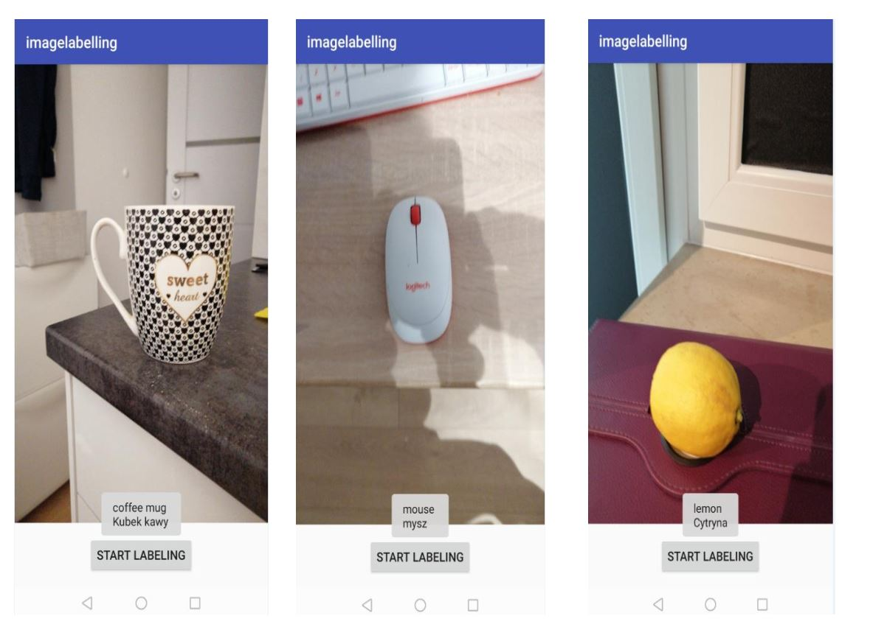

# ImageLabelling-thesis
imageLabelling Machine Learning Application

In this  work, using an object detection framework certain amount of objects
(around 500) will be able to be recognized and labelled on the Android mobile
platform. Combining state of the art machine learning (object detection) frameworks
with translation APIs; right after getting a shot of the pre-trained image, detecting its
identity and translating it into another language (for convenience Polish in this work)
is aimed to be reached.

